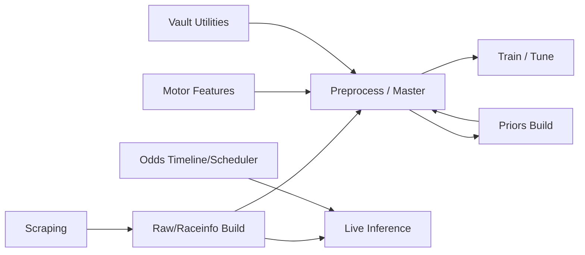

# scripts 辞典（現行29スクリプト）

本書は、`scripts/` 配下の**現行スクリプト辞典（アーカイブ除外）**です。  
対象は次の条件で抽出した **29個の `.py`** です。

- 対象: `scripts/**/*.py`
- 除外: `scripts/_archive/**`, `scripts/__init__.py`, `scripts/checks/**`
- 含む: `scripts/migrations/**`（現行メンテナンス系として扱う）

---

## 1. 全体像（図）



## 2. カテゴリ一覧（表）

| カテゴリ | 本数 | 主なスクリプト |
|---|---:|---|
| Scraping | 3 | `scrape.py`, `scrape_one_race.py`, `scrape_odds.py` |
| Build（raw/raceinfo/live） | 4 | `build_raw_csv.py`, `build_raceinfo.py`, `build_live_row.py`, `build_timeline_live.py` |
| Motor系 | 3 | `build_motor_artifacts_from_bins.py`, `build_motor_section_base.py`, `build_motor_section_features_n.py` |
| Priors系 | 3 | `build_tenji_prior_from_raw.py`, `build_season_course_prior_from_raw.py`, `build_season_winningtrick_prior_from_raw.py` |
| Preprocess/Master | 6 | `preprocess*.py`, `make_master_finals.py` |
| Train/Inference | 4 | `train.py`, `tune_hyperparams.py`, `predict_one_race.py`, `export_base_feature_yaml.py` |
| Data Utility | 3 | `vault_csv_by_pattern.py`, `export_vault.py`, `build_raw_with_motor_joined.py` |
| Migration | 1 | `migrations/2026-01-15_fix_section_id_full_raw.py` |

---

## 3. 29スクリプト総覧（SSOT用インデックス）

| # | script | カテゴリ | 主目的 | 主入力 | 主出力 |
|---:|---|---|---|---|---|
| 1 | `scripts/scrape.py` | Scraping | 日次の公式HTML一括取得 | date, 場/R指定 | `data/html/**` |
| 2 | `scripts/scrape_one_race.py` | Scraping | 1レース単位でHTML取得 | date/jcd/race | `data/live/html/**` |
| 3 | `scripts/scrape_odds.py` | Scraping | オッズ系HTML取得 | date/jcd/rno | `data/odds/html/**` |
| 4 | `scripts/build_raw_csv.py` | Build | 日次raw/refund生成 | `data/html/**` | `data/raw/*`, `data/refund/*` |
| 5 | `scripts/build_raceinfo.py` | Build | racelistからraceinfo生成 | `data/html/racelist/*.bin` | `data/processed/raceinfo/*` |
| 6 | `scripts/build_live_row.py` | Build | 1レース6行live raw生成 | live/html or html cache | `data/live/raw_*.csv` |
| 7 | `scripts/build_timeline_live.py` | Build | 当日レース時系列作成 | 開催日/開催場情報 | `data/timeline/*_timeline_live.csv` |
| 8 | `scripts/build_motor_artifacts_from_bins.py` | Motor | rankingmotor binから成果物化 | rankingmotor bin | motor系中間/成果CSV |
| 9 | `scripts/build_motor_section_base.py` | Motor | 節単位motorベース集計 | raw/master系 | motor section base |
| 10 | `scripts/build_motor_section_features_n.py` | Motor | n節窓のmotor特徴量作成 | section base | motor section features |
| 11 | `scripts/build_tenji_prior_from_raw.py` | Priors | 展示情報prior作成 | `data/raw/*.csv` | `data/priors/tenji/*` |
| 12 | `scripts/build_season_course_prior_from_raw.py` | Priors | season×course prior作成 | `data/raw/*.csv` | `data/priors/season_course/*` |
| 13 | `scripts/build_season_winningtrick_prior_from_raw.py` | Priors | season×決まり手prior作成 | `data/raw/*.csv` | `data/priors/winning_trick/*` |
| 14 | `scripts/preprocess.py` | Preprocess | raw→masterベース整形 | `data/raw/*.csv` | `data/processed/master.csv` |
| 15 | `scripts/preprocess_base_features.py` | Preprocess | base特徴量生成 | master, YAML設定 | `data/processed/base/*` |
| 16 | `scripts/preprocess_course.py` | Preprocess | entry/wakuban系集計特徴量 | raw日次群 | course系特徴量 |
| 17 | `scripts/preprocess_motor_id.py` | Preprocess | motor_id直結特徴量生成 | raw/master | motor_id特徴量 |
| 18 | `scripts/preprocess_motor_section.py` | Preprocess | motor節特徴量の整形 | motor section系 | motor section最終特徴量 |
| 19 | `scripts/preprocess_sectional.py` | Preprocess | section単位特徴量生成 | master/raw | sectional特徴量 |
| 20 | `scripts/make_master_finals.py` | Preprocess | 最終学習master統合 | 複数前処理成果物 | `master_finals` 系 |
| 21 | `scripts/train.py` | Train | モデル学習実行 | 各master/features | 学習済みモデル, metrics |
| 22 | `scripts/tune_hyperparams.py` | Train | ハイパラ探索 | 学習データ/設定 | 探索結果 |
| 23 | `scripts/predict_one_race.py` | Inference | 1レース推論 | live raw(6行), model | 予測CSV/表示用結果 |
| 24 | `scripts/run_odds_scheduler.py` | Inference/Odds | 指定時刻にオッズ取得を自動実行 | timeline, mins_before | 定期実行ログ/odds成果物 |
| 25 | `scripts/export_base_feature_yaml.py` | Utility | base特徴量YAML出力 | 学習済み設定/特徴量 | YAML定義ファイル |
| 26 | `scripts/vault_csv_by_pattern.py` | Utility | CSVをVault(SQLite)へ取り込み | CSV glob | SQLite更新 |
| 27 | `scripts/export_vault.py` | Utility | VaultからCSVへ復元 | SQLite DB | CSV群 |
| 28 | `scripts/build_raw_with_motor_joined.py` | Utility | rawへmotor情報JOINした派生生成 | raw + motor系 | joined raw |
| 29 | `scripts/migrations/2026-01-15_fix_section_id_full_raw.py` | Migration | full rawのsection_id修正 | 既存full raw | 修正済みfull raw |

---

## 4. 詳細辞典（カテゴリ別）

### 4.1 Scraping系

| script | 典型コマンド | 取得対象 | 失敗時/注意 |
|---|---|---|---|
| `scrape.py` | `python scripts/scrape.py --date YYYYMMDD` | pay/index/racelist/pcexpect/beforeinfo/raceresult/raceindex など | 欠落ページがあっても日次処理で後続が継続する設計を前提 |
| `scrape_one_race.py` | `python scripts/scrape_one_race.py --date YYYYMMDD --jcd 03 --race 11` | 単一レース必要HTML | ライブ推論時の最小取得に使う |
| `scrape_odds.py` | `python scripts/scrape_odds.py --date YYYYMMDD --jcd 12 --rno 11` | odds関連ページ | スケジューラ連携前提で、時刻依存の欠損に注意 |

### 4.2 Build系（raw/raceinfo/live）

| script | 生成物 | キー仕様 | 依存/連携 |
|---|---|---|---|
| `build_raw_csv.py` | `data/raw/YYYYMMDD_raw.csv`, `data/refund/YYYYMMDD_refund.csv` | `race_id`, `section_id` を基軸に正規化 | `scrape.py` 後に実行 |
| `build_raceinfo.py` | `data/processed/raceinfo/raceinfo_YYYYMMDD.csv` | racelist `.bin` 単位で日次集約 | `src/raceinfo_features.py` にロジック委譲 |
| `build_live_row.py` | `data/live/raw_YYYYMMDD_JCD_R.csv` | 1レース6行、推論直結フォーマット | `predict_one_race.py` の直接入力 |
| `build_timeline_live.py` | `data/timeline/*_timeline_live.csv` | 当日レース時系列（場×R×時刻） | `run_odds_scheduler.py` の入力 |

### 4.3 Motor系

| script | 役割 | 入力 | 出力 |
|---|---|---|---|
| `build_motor_artifacts_from_bins.py` | rankingmotor系HTML(bin)の抽出・整形 | `data/html/rankingmotor*.bin` | motor artifact CSV/中間 |
| `build_motor_section_base.py` | 節単位モーター基礎集計の生成 | raw/master | section base |
| `build_motor_section_features_n.py` | 複数節窓（n）特徴量へ展開 | section base | 学習結合用 motor features |

### 4.4 Priors系

| script | prior軸 | 主要キー | 主要出力列（例） |
|---|---|---|---|
| `build_tenji_prior_from_raw.py` | 展示系 | place/season等 | prior確率 + メタ列 |
| `build_season_course_prior_from_raw.py` | 季節×entry | `place, entry, season_q` | `p*`, `base_p*`, `adv_p*`, `lr_p*` |
| `build_season_winningtrick_prior_from_raw.py` | 季節×決まり手 | place/season/winning_trick | 決まり手確率・相対化列 |

### 4.5 Preprocess/Master系

| script | 役割 | 代表入力 | 代表出力 |
|---|---|---|---|
| `preprocess.py` | rawの型補正・基礎前処理 | raw日次CSV群 | `master.csv` |
| `preprocess_base_features.py` | base特徴量のSSOT整合生成 | master + YAML | base特徴量一式 |
| `preprocess_course.py` | course/wakuban系集計特徴量 | raw日次CSV群 | course特徴量 |
| `preprocess_motor_id.py` | motor_idベース特徴量 | raw/master | motor_id特徴量 |
| `preprocess_motor_section.py` | motor節特徴量の最終整形 | motor section features | 学習結合可能形式 |
| `preprocess_sectional.py` | 節単位特徴量生成 | raw/master | sectional特徴量 |
| `make_master_finals.py` | 各特徴量の最終統合 | preprocess成果群 | 最終学習master |

### 4.6 Train / Inference / Utility / Migration

| script | 区分 | 何をするか | 主な接続先 |
|---|---|---|---|
| `train.py` | Train | 学習・モデル保存・評価出力 | `models/**`, `data/processed/**` |
| `tune_hyperparams.py` | Train | 学習パラメータ探索 | `train.py` と同系入力 |
| `predict_one_race.py` | Inference | 1レース推論（live raw入力） | `build_live_row.py` |
| `run_odds_scheduler.py` | Inference/Odds | timelineに従いodds取得ジョブ起動 | `build_timeline_live.py`, `scrape_odds.py` |
| `export_base_feature_yaml.py` | Utility | 特徴量YAMLの出力/同期 | base feature SSOT |
| `vault_csv_by_pattern.py` | Utility | CSV→Vault DB取り込み | `docs/vault_guide.md` 運用 |
| `export_vault.py` | Utility | Vault DB→CSV復元 | `docs/vault_guide.md` 運用 |
| `build_raw_with_motor_joined.py` | Utility | raw + motorのJOIN成果物生成 | raw, motor特徴量 |
| `migrations/2026-01-15_fix_section_id_full_raw.py` | Migration | 過去full rawの `section_id` 修復 | 既存full rawメンテ |

---

## 5. 入口ドキュメント別の対応表（used_by）

| 入口（SSOT） | 主に参照するscript |
|---|---|
| `docs/training_pipeline.md` | `scrape.py`, `build_raw_csv.py`, `build_raceinfo.py`, `preprocess*.py`, `make_master_finals.py`, `train.py`, `tune_hyperparams.py` |
| `docs/inference_pipeline.md` | `scrape_one_race.py`, `build_live_row.py`, `predict_one_race.py`, `build_timeline_live.py`, `run_odds_scheduler.py` |
| `docs/usage_odds.md` | `build_timeline_live.py`, `run_odds_scheduler.py`, `scrape_odds.py` |
| `docs/priors_pipeline.md` | `build_tenji_prior_from_raw.py`, `build_season_course_prior_from_raw.py`, `build_season_winningtrick_prior_from_raw.py` |
| `docs/vault_guide.md` | `vault_csv_by_pattern.py`, `export_vault.py` |
| `batch/*.ps1` | `scrape.py`, `build_raw_csv.py`, `build_raceinfo.py`, prior系, preprocess系 |

---

## 6. 運用ルール（この辞典の更新規約）

| ルール | 内容 |
|---|---|
| 追加時 | 新規 `scripts/*.py` を追加したら、まず本書「3.総覧」に1行追加 |
| 廃止時 | 廃止scriptは「削除」ではなく履歴注記を残し、必要なら `_archive` へ移管 |
| 仕様更新時 | 入力/出力/キー列が変わったら「4.詳細辞典」を同時更新 |
| SSOT整合 | 入口ドキュメント変更時は「5.used_by表」を更新 |
| 定期点検 | リリース単位で `find scripts -name '*.py'` の件数差分を確認 |

## 7. 抽出コマンド（再現性）

```bash
# 現行辞典の対象29本（_archive, __init__, checks を除外）
find scripts -name '*.py' \
  | grep -v 'scripts/_archive/' \
  | grep -v 'scripts/__init__.py' \
  | grep -v 'scripts/checks/' \
  | sort
```
